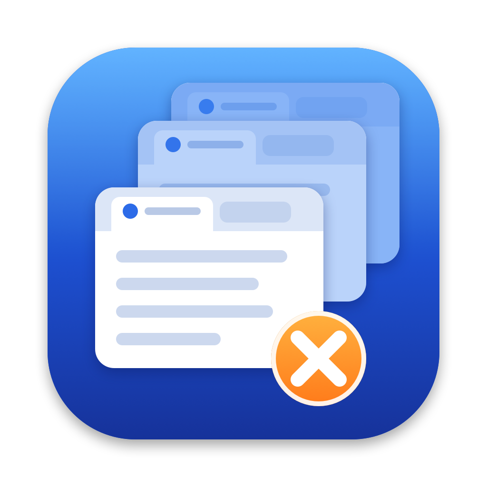

<p align="center"></p>

# Tab Dupes

A small macOS app that finds duplicate tabs across all your Safari windows and closes the extras, keeping one of each.

If you've ever ended up with the same dashboard open in five windows, this finds them all in one list, grouped by page, with a single button to tidy them up.

## Features

- **Every window at once.** Scans all open Safari windows and groups tabs that point at the same page, showing which window and tab position each copy is in.
- **One-click cleanup.** Close every duplicate in one go, or one group at a time. In each group you choose which copy survives; by default it keeps the tab that's currently showing.
- **Works with Safari closed.** When Safari isn't running, it shows the tabs Safari will reopen on next launch, so you can see the damage before opening it.
- **Sensible matching.** Treats `http`/`https`, `www.`, trailing slashes and tracking tags (`utm_*`, `fbclid`, `gclid`…) as the same page. Optional looser matching ignores `#anchors` or `?query` strings, but never merges single-page-app routes like `#/inbox/123`.
- **Leaves Google searches alone** by default, since different searches share the same address.
- **Careful closing.** Before closing a tab it re-checks the address, and skips any tab that has moved or changed since the last scan. Closed tabs can be reopened from Safari's History menu.
- **Stays current.** Rescans when you switch to the app, when Safari opens or quits, and on ⌘R.

## Requirements

- macOS 14 Sonoma or later
- Xcode or the Command Line Tools (`xcode-select --install`) to build

## Install

```sh
git clone https://github.com/jowtron/tab-dupes.git
cd tab-dupes
./build.sh --install   # builds and copies Tab Dupes.app to /Applications
```

`./build.sh` alone builds into `build/` without installing. It signs with your `Apple Development` certificate if you have one (override with `CODESIGN_IDENTITY`), which lets macOS remember the app's permissions across rebuilds; otherwise it signs ad hoc.

## Permissions

- **Automation → Safari.** Needed to read and close tabs while Safari is open. macOS asks the first time the app scans.
- **Full Disk Access** (optional). Only needed to read your tabs while Safari is closed, because Safari keeps them in a protected folder. Add Tab Dupes under System Settings › Privacy & Security › Full Disk Access. Without it, just open Safari first.

## Privacy

Everything happens on your Mac. Tab Dupes makes no network requests, and it never writes to Safari's data; when Safari is closed it reads a temporary copy of the tab database and deletes it afterwards.

## How it works

- **Safari open:** reads tabs live via JXA run through `/usr/bin/osascript` (`Sources/Safari.swift`). Closing goes from the highest tab index down within each window so earlier indices stay valid.
- **Safari closed:** reads a copy of `~/Library/Containers/com.apple.Safari/Data/Library/Safari/SafariTabs.db` (`Sources/SavedTabs.swift`). Each window's tabs are `bookmarks` rows (type 0) under the folder in `windows.local_tab_group_id`; the selected tab is `windows_tab_groups.active_tab_id`. Local file tabs have an empty `url` column, with the address in `LocalURL` inside the `extra_attributes` plist. This schema is undocumented and was checked on macOS 26.
- **Matching:** `Sources/URLKey.swift`. Route-style fragments (`#/…`, `#!…`, anything containing `/`) are always kept. A tab with a title but no address is never treated as a duplicate.
- **Icon:** drawn in code by `icon/make-icon.swift`. `build.sh` re-renders it when the script changes and cuts the `.icns` from `icon/AppIcon-1024.png`; replace that PNG to use your own.
